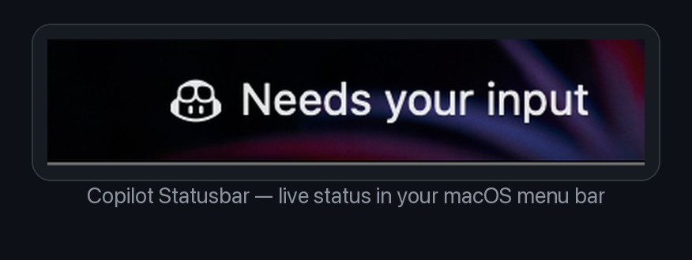

# Copilot Statusbar for macOS



Native macOS menu bar app for [GitHub Copilot CLI](https://github.com/github/copilot-cli).

It shows one of three states in the menu bar, based on the `copilot` CLI process:

- **Waiting for a task** (gray icon) — Copilot CLI is not running
- **Needs your input** (amber icon) — Copilot CLI is running and idle at the prompt
- **working 3m**, **working 1h 12m**, etc. (blue icon) — Copilot CLI is actively generating a response / running a tool

Click the menu bar item for details (PID, CPU usage, current command) and quick actions.

Here's what it looks like among your other menu bar icons:


## Install (recommended for end users)

1. Download the latest `Copilot Statusbar.dmg` from the [Releases](../../releases) page.
2. Open the `.dmg` and drag **Copilot Statusbar.app** into the **Applications** shortcut, just like any other Mac app.
3. Launch it from Applications (or Spotlight).

> **First launch on macOS may show a Gatekeeper warning** ("cannot be opened because Apple cannot check it for malicious software"), since this app isn't yet signed with a paid Apple Developer certificate. To open it anyway: right-click the app in Applications → **Open** → **Open** in the confirmation dialog. You only need to do this once.

## Build from source

```bash
make build
```

## Run during development

```bash
make run
```

## Create `.app`

```bash
make app
open "dist/Copilot Statusbar.app"
```

## Install locally (for development)

```bash
make install
open "/Applications/Copilot Statusbar.app"
```

## Build a distributable `.dmg`

```bash
make dmg
```

Produces `dist/Copilot Statusbar.dmg` — a standard drag-to-Applications installer disk image, ready to attach to a GitHub release.

## Homebrew packaging later

This project intentionally uses only Swift Package Manager and AppKit, so it can be packaged with a simple Homebrew formula/cask:

- `swift build -c release` for a CLI-style binary
- `make app` for a macOS `.app` bundle
- `make dmg` for a distributable disk image

Linux should be a separate implementation later, likely using AppIndicator/GTK or Qt tray APIs.
